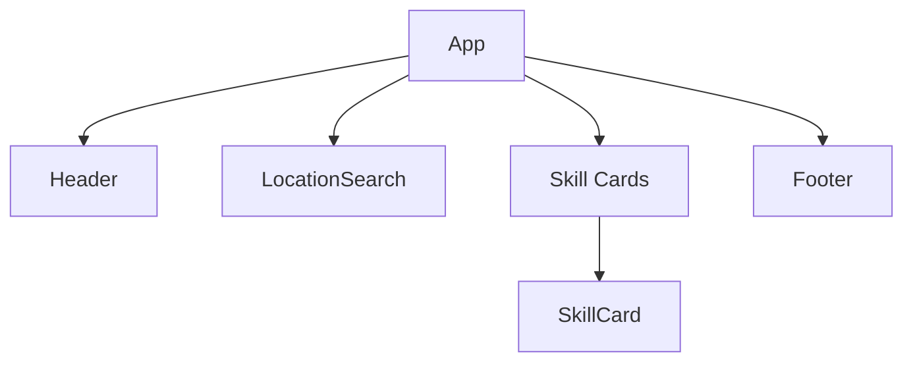

# SkillSwap

needs some improvements

## Project Status

- **UI Framework**: Chakra UI
- **Implemented Features**:
  - Firebase Authentication Integration
  - Responsive Layout System
  - Location Search Component
  - Profile Management Scaffolding
- **Pending Features**:
  - Skill Listing Interface
  - Match Notification System
  - User Rating Mechanism

## Tech Stack

- **Frontend**: React + TypeScript, Chakra UI
- **Backend**: Node.js/Express.js (TypeScript)
- **Database**: MongoDB
- **Mapping**: Mapbox GL JS (Integration Started)

## Development Practices

- Component-driven architecture
- Type-safe API contracts
- Environment-based configuration

## Implementation Checklist

- [.] Backend/Frontend API Integration
- [.] TypeScript Migration
- [ ] Real-time Chat System
- [ ] Location-based Matching
- [ ] Skill Verification Workflow

## Current Implementation Status

(need more accuracy and coordination -\_-)

Implemented Features:

- Firebase Authentication
- Location-Based Skill Filtering (Haversine formula)
- Skill Card Component with:
  - User ratings
  - Connection requests
  - Distance display

🛠 Tech Stack:

- Frontend: React + TypeScript, Chakra UI
- Mapping: Mapbox GL JS
- Backend: Node.js/Express.js (WIP)

## UI Components

