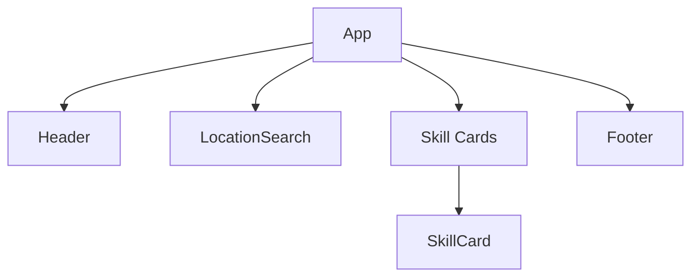

# Currently working ^\_~

## Tech Stack

- **Frontend**: React + TypeScript, Chakra UI
- **Backend**: Node.js/Express.js (TypeScript)
- **Database**: MongoDB
- **Mapping**: Mapbox GL JS (Integration Started)

## Development Practices

- Component-driven architecture
- Type-safe API contracts
- Environment-based configuration

## Current Implementation Status

need more accuracy and coordination -\_-

Implemented Features(may not work properly):

- Firebase Authentication
- Location-Based Skill Filtering (Haversine formula)
- Skill Card Component with:
  - User ratings
  - Connection requests
  - Distance display

## UI Components

