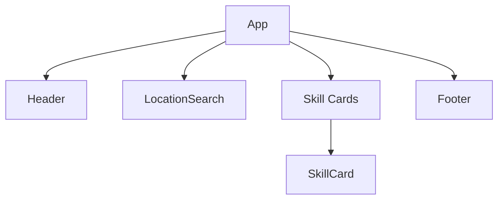

# SkillSwap

## Project Status

- **UI Framework**: Migrated to Chakra UI
- **Implemented Features**:
  - Firebase Authentication Integration
  - Responsive Layout System
  - Location Search Component
  - Profile Management Scaffolding
- **Pending Features**:
  - Skill Listing Interface
  - Match Notification System
  - User Rating Mechanism

## Tech Stack

- **Frontend**: React + TypeScript, Chakra UI
- **Backend**: Node.js/Express.js (TypeScript)
- **Database**: MongoDB
- **Mapping**: Mapbox GL JS (Integration Started)

## UI Structure
## UI Architecture

**Component Hierarchy**:
```tsx
<App>
  <AuthProvider>
    <Header />
    <Main>
      <LocationSearch />
      <SkillGrid>
        <SkillCard 
          rating={4.5}
          distance="2km"
          onConnect={() => handleRequest()}
        />
      </SkillGrid>
    </Main>
    <Footer />
  </AuthProvider>
</App>
```
- **Maps**: Mapbox GL JS

## Development Practices

- Component-driven architecture
- Type-safe API contracts
- Environment-based configuration
- Automated testing (Jest/Testing Library)

## Implementation Checklist

- [x] Backend/Frontend API Integration
- [x] TypeScript Migration
- [ ] Real-time Chat System
- [ ] Location-based Matching
- [ ] Skill Verification Workflow

## Learning Focus

- TypeScript Full-Stack Development
- Firebase Authentication Patterns
- MongoDB Geospatial Queries
- Real-time API Design (REST)
- Mapbox GL JS Integration

## Current Implementation Status

✅ Implemented Features:
- Firebase Authentication
- Location-Based Skill Filtering (Haversine formula)
- Skill Card Component with:
  - User ratings
  - Connection requests
  - Distance display

🛠 Tech Stack:
- Frontend: React + TypeScript, Chakra UI
- Mapping: Mapbox GL JS
- Backend: Node.js/Express.js (WIP)

## UI Components


